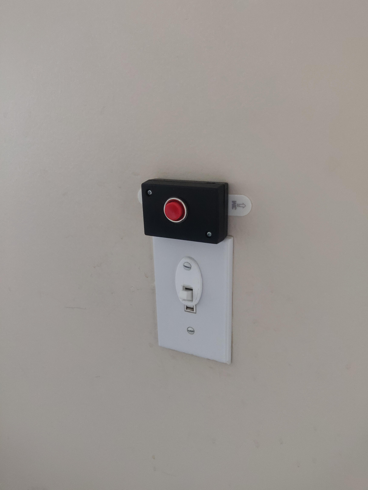
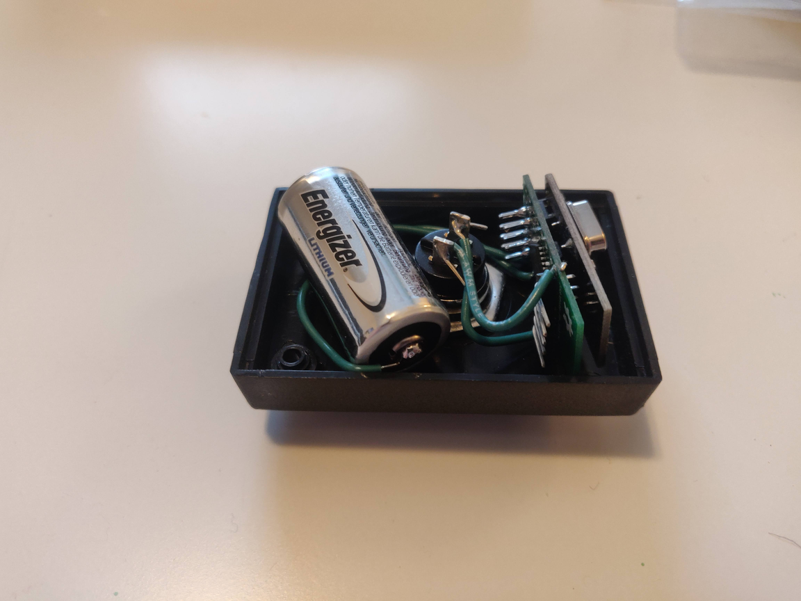

Light Buttons
===

With Hue bulbs in most of my light fixtures, I needed a way to control them that still felt "natural". I'd much rather have used smart switches, to keep functionality in case of a power outage, but being in an apartment makes that challenging.

The solution was a small wall-button:

It consists of a [Sensebender Micro](https://www.mysensors.org/hardware/micro) (PCB from JLCPCB, then hand-assembled), a small momentary switch, and a CR123 battery (which is one of the smaller alkaline cells, and provides 3v. They're not the cheapest, but they work well). The whole thing fits into the smallest enclosure that was available at my local parts store, producing a nice compact package.

The whole thing lasts for at least 6 months on a single battery, depending on how often the button is pressed.

To help kick the habit of turning light switches off when walking out of the room, I also designed and 3d-printed a part that goes under the cover plate screw, and holds the light switch in the "on" position. The design file for that is in `switch_holder.stl`

