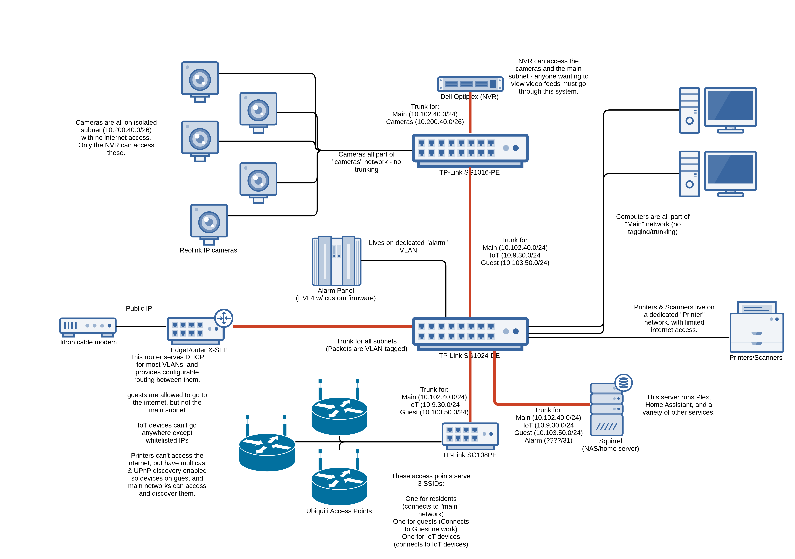

Network Layout
===

This is a rough overview of my home network layout. Subnet numbering has been randomized.

Some things that may be of interest:

- Red links in this diagram are _trunks_ and carry multiple VLANs over them, with 802.1q tagging.
- EdgeRouter ER-X-SFP is the router for the entire network. It handles inter-VLAN routing, and mDNS propagation.
- I use 3 TP-link switches. They have been rock-solid, and these models support a web-based management interface for VLAN configuration, etc. Highly recommended for the price.
- Ideally, I would replace all three switches with something like a MicroTik crs354-48p-4s-2q-rm, though price is the main barrier to entry.
- The cameras are Reolink's cheapest models. I bought them with the intention of upgrading to Hikvision or similar as they die off, but thus far have been quite solid without issue.
- My camera recorder runs on [Frigate](https://github.com/blakeblackshear/frigate), on top of a Dell Optiplex mini-PC. This enables 24/7 recording and event detection using AI. System has been working without issue for several months now.
- Alarm panel is an Envisalink EVL-4 running my [custom firmware](https://github.com/magmastonealex/smart-home/tree/master/evl4-cfw). It reports sensor states using CoAP.
- Squirrel is my main server hosting a number of applications for the home, in addition to ~20TB of media and document storage. The UniFi controller runs here.
- Not pictured is a persistent WireGuard VPN tunnel between a few nodes in this network and my personal devices.
- Also not pictured is the cellular backup link for alerting & "emergency" internet services.

All this equipment lives in a rack with so-so organization:

