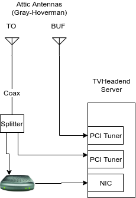

This document describes my Over The Air (OTA) TV processing solution. It's been a multi-year project, with a lot of lessons learned. This isn't a paragon of good systems design, nor should anyone copy it exactly (at least not yet!) But hopefully you can find this guide useful in your own adventure. I'm writing this document in the hopes that it'll help me to design a more robust, cleaner, and replicable system to replace this one. 

Hardware
===



The hardware side of the system is based around three Gray-Hoverman antennas. One is pointed directly at CN tower, one is pointed towards Buffalo, one is pointed towards Hamilton. Coax cable runs from the attic to the basement. Currently, only two are in use - Toronto and Buffalo. The Toronto antenna is where most of the shows I watch come from, so it's split and fed to two tuners - one HDHomeRun dual-tuner, and one PCI (yes, PCI, not PCIe) tuner (a Hauppage HVR-1600). The Buffalo antenna goes into another PCI tuner (ATI HDTV Wonder).

If I were doing this over again, I'd go with two or three HDHRs instead of the PCI cards. The PCI cards are cheaper (at least when I started this project in mid-2014), but more of a hassle than they're worth - firmware and interference issues, plus it's way easier to deal with IP traffic than it is to manage coax. It would enable this application to be easily dockerized and moved between machines.

The HDHomeRun works perfectly, except for a little weirdness I started noticing - Packets were being dropped constantly, even with a single stream at around 20mbit/s - nowhere near the 100mbit line rate, or the gigabit line rate to the TV server. I needed two approaches to solve this - one, switching to HTTP streaming intead of the HDHR protocol, and two, directly connecting the HDHR to a NIC on the server, taking a switch out of the loop entirely. My best guess is that it was some weirdness with the cheap TP-Link switch I was using to put the HDHomeRun on the rest of my home network. I'd highly reccomend isolating the HDHomeRuns somehow.


Software
===

TVHeadend drives most of the process. I can't reccomend it enough. It's able to read video from just about anywhere - anything from SAT>IP to stdout from ffmpeg, including DVB cards and HTTP natively. It's very flexible in recording and live streaming - I also use it to stream to Plex's LiveTV feature via [Antennas](https://github.com/TheJF/antennas), where it transcodes video to h.264 at a lower bitrate for sending over the Internet live.

The recording process looks something like this:


Schedule data comes in via schedules-direct, and a tiny cron script:

```
tv_grab_sd_json --days 21 --output tv2.xml
cat tv2.xml | socat - UNIX-CONNECT:/home/hts/.hts/tvheadend/epggrab/xmltv.sock
```

(note that to enable that socket, you need to enable the XMLTV grabber in tvheadend.)

Once a show has been recorded, a post-processing script is run (started by tvheadend), `headendproc`. This script is responsible for determining the recording's new filename, based on three heuristics:

 1) Schedules Direct provided season/episode.
 2) If unavailable, look at TVDB for show name + episode name to try and find season/episode.
 3) Fall back to date and show name, which is often good enough for Plex.

It then passes off the source file, and destination filename to another script, 'en.py'. This script invokes the `comskip` utility ([available here](https://www.comskip.org/)), which is able to provide excellent commercial detection. It provides an Edit Decision List (EDL) file, which the script then uses to slice the file on commercial boundaries. It does a quick sanity check to ensure that at least 55% of the duration of the file is still present - I found that occasionally Comskip would mess up and mark most of the show as a commercial, cutting it out. If the video is too short, it's passed on in the full, un-comskipped form.
The final step is to run `ccextractor`, which is able to provide SRT (or SSA) subtitles for the final cut recording based on teletext data within the video.

The final output files are processed using my ffproc tool, for distributed transcoding (these files are usually interlaced, but the metadata doesn't include it. ffproc is configured to force deinterlacing).

All of the scripts are included in this directory. They are _not_ good. But they work! There's a great opportunity to add tests and dramatically simplify the code. 